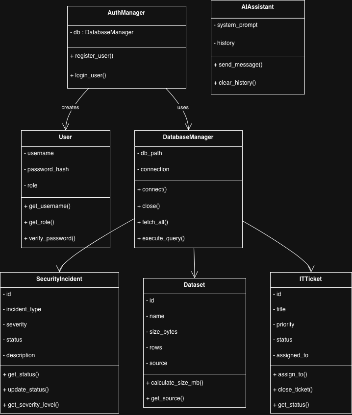

# Multi-Domain Intelligence Platform

## Overview
This project is a Streamlit-based Multi-Domain Intelligence Platform developed for CST1510.
It integrates Cybersecurity, Data Science, IT Operations, and AI Assistance using an
Object-Oriented Programming (OOP) architecture.

## Architecture
The system follows a layered architecture:

- **Models**: Domain entities (User, SecurityIncident, Dataset, ITTicket)
- **Services**: Business logic and integrations (DatabaseManager, AuthManager, AIAssistant)
- **Database**: SQLite database for persistent storage
- **Pages**: Streamlit UI pages for each domain
- **AI Integration**: AI Assistant wrapped in a service class

## Key Features
- Secure user authentication (OOP-based)
- Cybersecurity incident management
- Dataset metadata viewing
- IT ticket tracking
- AI assistant using service abstraction
- Full separation of concerns (UI, logic, data)

## Technologies Used
- Python
- Streamlit
- SQLite
- Object-Oriented Programming (OOP)

## UML Class Diagram
The following UML diagram shows the object oriented architecture of the system, including domain models and service classes used across the platform.


## How to Run
```bash
streamlit run Home.py